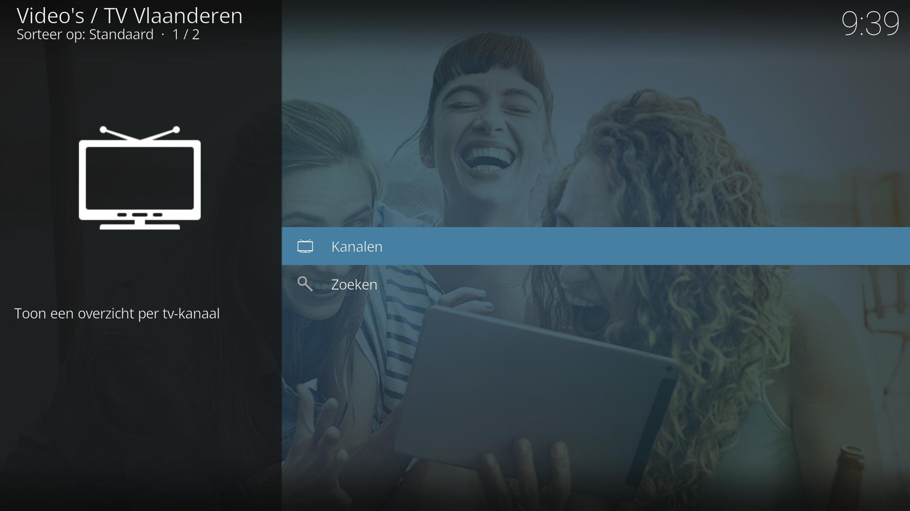
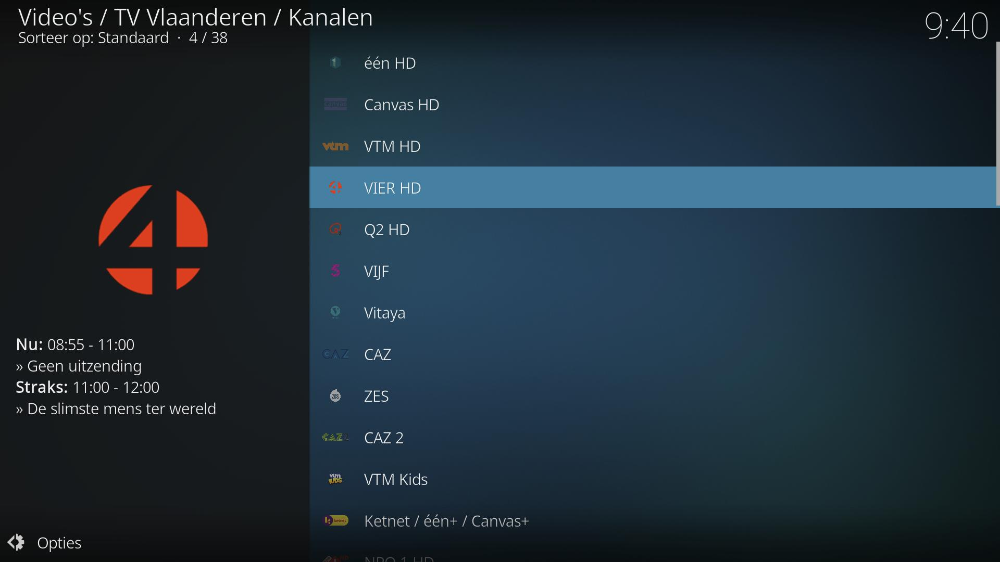
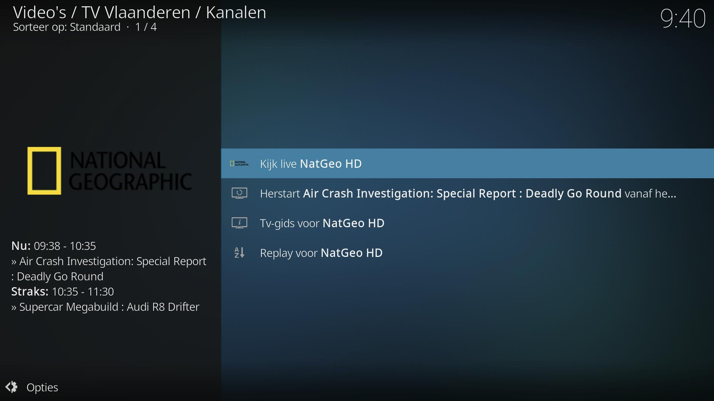

# TV Vlaanderen Kodi Add-on

*plugin.video.tvvlaanderen* is een Kodi add-on om Live TV, Restart en Replay te bekijken met je TV Vlaanderen abonnement. 

> Note: Je hebt hiervoor een betaald abonnement nodig bij [TV Vlaanderen](https://www.tv-vlaanderen.be/).

Meer informatie kan je vinden op de [Wiki pagina](https://github.com/add-ons/plugin.video.tvvlaanderen/wiki).

## Features

De volgende features worden ondersteund:
* Live TV
* Restart TV, bekijk het huidige programma vanaf het begin (niet voor alle zenders)
* Replay TV, bekijk een programma tot 7 dagen terug (niet voor alle zenders)
* Doorzoeken van alle programma's
* Integratie met [IPTV Manager](https://github.com/add-ons/service.iptv.manager)

## Screenshots

<table>
  <tr>
    <td></td>
    <td></td>
    <td></td>
  </tr>
 </table>

## Disclaimer

Deze add-on wordt niet ondersteund door TV Vlaanderen, en wordt aangeboden 'as is', zonder enige garantie.
TV Vlaanderen is een merk van Canal+ Luxembourg S. à r.l.
